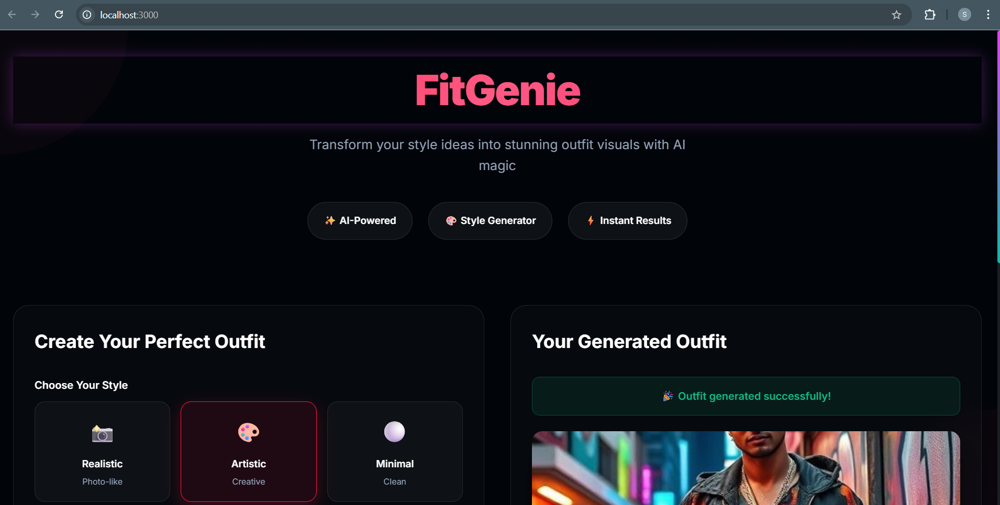
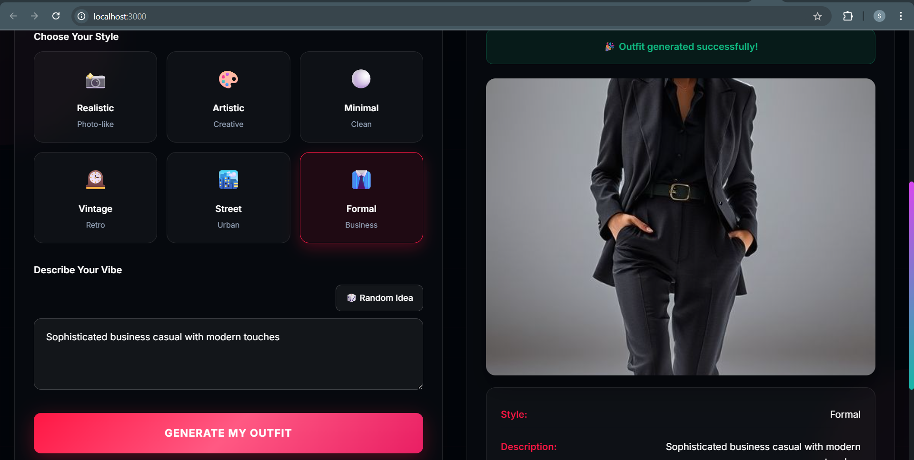
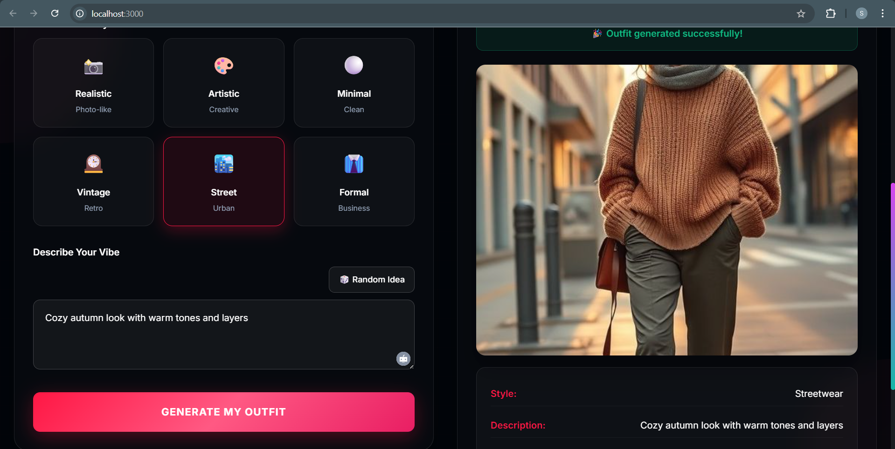
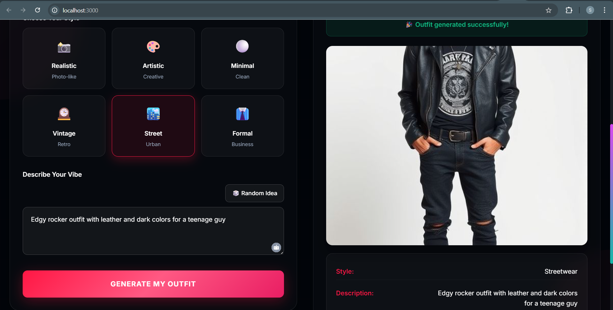

# FitGenie 🧞‍♀️

> **AI-Powered Outfit Generator** - Your personal styling assistant that creates perfect outfit combinations using advanced AI technology.

FitGenie is a full-stack web application that transforms your style preferences into stunning, personalized outfit suggestions instantly using cutting-edge AI algorithms.

---

## ✨ Features

🎯 **Smart AI Generation** - Advanced algorithms create outfit combinations based on your style preferences  
🎨 **Personalized Styling** - Tailored recommendations that match your unique taste and occasion  
📱 **Responsive Design** - Seamless experience across desktop, tablet, and mobile devices  
🖼️ **Image Upload Support** - Upload your clothing items for AI-powered mix-and-match suggestions  
⚡ **Real-time Processing** - Lightning-fast outfit generation with instant results  
🌈 **Style Customization** - Filter by color, occasion, weather, and personal preferences  
💾 **Outfit History** - Save and revisit your favorite generated outfits  

---

## 🛠️ Tech Stack

### Frontend
- **React.js** - Modern JavaScript library for building user interfaces
- **TailwindCSS** - Utility-first CSS framework for styling
- **HTML5 & CSS3** - Modern web standards
- **JavaScript ES6+** - Latest JavaScript features

### Backend
- **Node.js** - JavaScript runtime environment
- **Express.js** - Fast, unopinionated web framework
- **Multer** - Middleware for handling file uploads
- **RESTful APIs** - Clean and scalable API architecture

### Development Tools
- **npm/yarn** - Package management
- **PostCSS** - CSS transformation tool
- **Git & GitHub** - Version control and collaboration
- **VS Code** - Development environment

---

## 📂 Project Structure

```
FitGenie/
├── 📁 backend/
│   ├── 📁 controllers/
│   │   └── imageController.js      # AI image generation logic
│   ├── 📁 middleware/
│   │   └── auth.js                 # Authentication middleware
│   ├── 📁 routes/
│   │   └── generate.js             # Main API routes
│   ├── 📁 uploads/                 # User uploaded outfit images
│   ├── 📁 utils/
│   │   └── imageUtils.js           # Image processing utilities
│   ├── server.js                   # Express server entry point
│   ├── package.json                # Backend dependencies
│   └── .env                        # Environment variables
├── 📁 frontend/
│   ├── 📁 public/
│   │   └── index.html              # Main HTML template
│   ├── 📁 src/
│   │   ├── 📁 components/          # React components
│   │   ├── 📁 pages/               # Page components
│   │   ├── 📁 styles/              # CSS stylesheets
│   │   ├── App.js                  # Main React component
│   │   └── index.js                # React DOM entry point
│   ├── package.json                # Frontend dependencies
│   ├── tailwind.config.js          # TailwindCSS configuration
│   ├── postcss.config.js           # PostCSS configuration
│   └── .env                        # Frontend environment variables
├── 📁 screenshots/                 # Project screenshots
├── 📁 node_modules/                # Project dependencies
├── README.md                       # Project documentation
├── .gitignore                      # Git ignore rules
├── package.json                    # Root package.json
└── package-lock.json               # Dependency lock file
```

---

### Prerequisites
- **Node.js** (v16.0 or higher)
- **npm** or **yarn**
- **Git** for version control

### 1️⃣ Clone the Repository
```bash
git clone https://github.com/yourusername/FitGenie.git
cd FitGenie
```

### 2️⃣ Install Root Dependencies
```bash
# Install root dependencies
npm install
```

### 3️⃣ Backend Setup
```bash
# Navigate to backend directory
cd backend

# Install backend dependencies
npm install

# Create environment file
touch .env
# Add your environment variables (see Configuration section)

# Start the backend server
npm start
```
The backend server will run on `http://localhost:5000`

### 4️⃣ Frontend Setup
```bash
# Navigate to frontend directory (from project root)
cd frontend

# Install frontend dependencies
npm install

# Start the development server
npm start
```
The frontend development server will run on `http://localhost:3000`

### 5️⃣ Access the Application
Open your browser and navigate to **http://localhost:3000** 🎉

---

## 🔧 Configuration

### Backend Environment Variables (.env)
```env
# Server Configuration
PORT=5000
NODE_ENV=development

# AI Service API Keys
OPENAI_API_KEY=your_openai_api_key_here
STABILITY_AI_KEY=your_stability_ai_key_here

# File Upload Configuration
UPLOAD_PATH=./uploads
MAX_FILE_SIZE=10485760

# CORS Configuration
FRONTEND_URL=http://localhost:3000
```

### Frontend Environment Variables (.env)
```env
# API Configuration
REACT_APP_API_URL=http://localhost:5000
REACT_APP_UPLOAD_URL=http://localhost:5000/uploads

# Feature Flags
REACT_APP_ENABLE_ANALYTICS=false
```

---

## 📖 API Documentation

### Base URL: `http://localhost:5000/api`

#### 🔗 Main Endpoints

| Method | Endpoint | Description | Parameters |
|--------|----------|-------------|------------|
| `POST` | `/generate` | Generate outfit based on preferences | style, occasion, colors |
| `POST` | `/upload` | Upload clothing item image | multipart/form-data |
| `GET` | `/outfits` | Retrieve generated outfits | limit, offset |
| `DELETE` | `/outfit/:id` | Delete specific outfit | id |

#### Example API Usage:
```javascript
// Generate outfit
const response = await fetch('http://localhost:5000/api/generate', {
  method: 'POST',
  headers: {
    'Content-Type': 'application/json',
  },
  body: JSON.stringify({
    style: 'casual',
    occasion: 'work',
    colors: ['blue', 'white'],
    weather: 'mild'
  })
});
```

---

## 🎨 How It Works

1. **User Input** - Select style preferences, occasion, and color scheme
2. **AI Processing** - Advanced algorithms analyze preferences and generate combinations
3. **Image Generation** - Create visual representations of outfit suggestions
4. **Personalization** - Learn from user feedback to improve future recommendations
5. **Save & Share** - Store favorite outfits and share with friends

---

## 🚀 Deployment

### Local Development
```bash
# Run both frontend and backend concurrently
npm run dev
```

### Production Build
```bash
# Build frontend for production
cd frontend
npm run build

# Start production server
cd ../backend
npm run start:prod
```

---

## 🔮 Roadmap & Future Enhancements

- [ ] **User Authentication** - Personal accounts and saved preferences
- [ ] **Social Features** - Share outfits and follow fashion influencers
- [ ] **Weather Integration** - Real-time weather-based recommendations
- [ ] **Shopping Links** - Direct purchase links for recommended items
- [ ] **AR Try-On** - Virtual outfit visualization using camera
- [ ] **Style Analytics** - Personal fashion insights and trends
- [ ] **Mobile App** - React Native mobile application
- [ ] **Multi-language Support** - Internationalization features

---

## 🤝 Contributing

We welcome contributions from the community! Here's how you can help:

### Development Process
1. **Fork** the repository
2. **Create** a feature branch (`git checkout -b feature/amazing-feature`)
3. **Commit** your changes (`git commit -m 'Add amazing feature'`)
4. **Push** to the branch (`git push origin feature/amazing-feature`)
5. **Open** a Pull Request

### Development Guidelines
- Follow ESLint configuration
- Write meaningful commit messages
- Add tests for new features
- Update documentation as needed
- Ensure responsive design compatibility

### Code Style
- Use meaningful variable names
- Comment complex logic
- Follow React best practices
- Maintain consistent formatting

---

## 🐛 Bug Reports & Feature Requests

Found a bug or have a feature request? Please create an issue on our [GitHub Issues](https://github.com/yourusername/FitGenie/issues) page.

### Bug Report Template
- **Description**: Brief description of the bug
- **Steps to Reproduce**: How to reproduce the issue
- **Expected Behavior**: What should happen
- **Screenshots**: If applicable, add screenshots
- **Environment**: OS, browser, Node.js version

---

## 👩‍💻 Author

**Sahana R**

---

## 🙏 Acknowledgments

- **OpenAI** for AI integration capabilities
- **React Team** for the incredible frontend framework
- **TailwindCSS** for beautiful, responsive styling
- **Node.js Community** for robust backend support
- **Open Source Contributors** worldwide 🌍

---

## 🖼️ Screenshots









---

<div align="center">

### Hope you like it! ✨

*Transform your style, one outfit at a time*

[🔝 Back to top](#fitgenie-️)

</div>